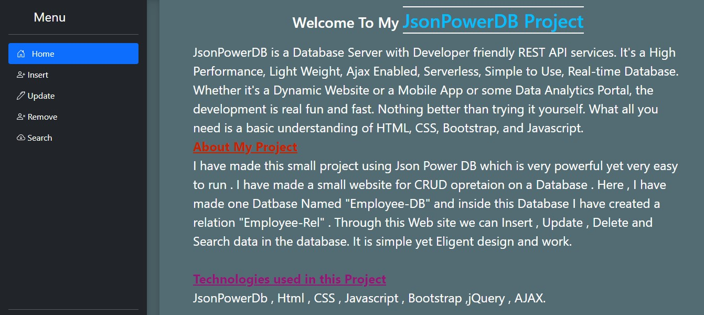
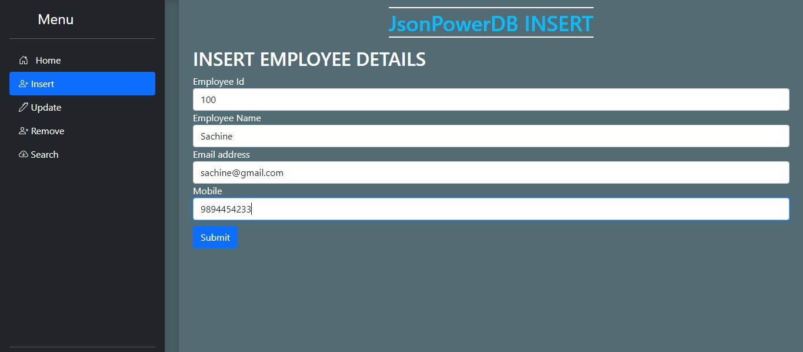
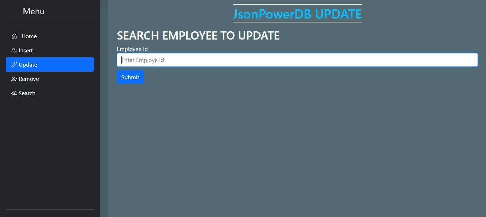
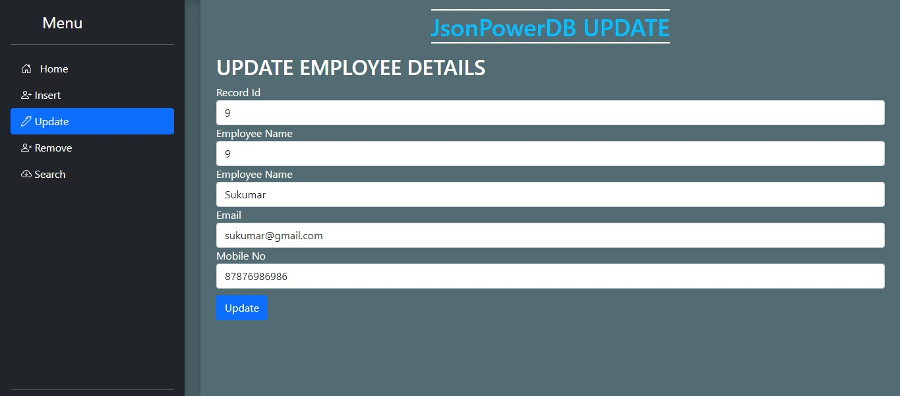
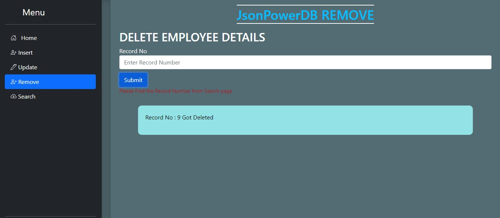
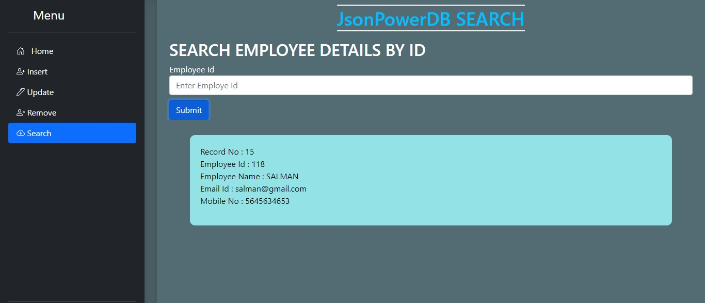
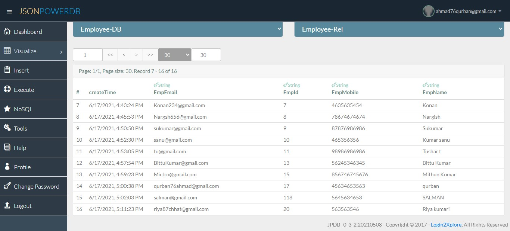

# JSON PowerDB

This mini-project performs CRUD operations on an emlployee relation in JsonPowerDB.We can insert , remove , update and search employee details in this website. This project is made with JsonPowerDB , Html , CSS , Javascript ,jQuery , AJAX , Bootstrap.

## About JsonPowerDB

JsonPowerDB is a Database Server with Developer friendly REST API services. It's a High Performance, Light Weight, Ajax Enabled, Serverless, Simple to Use, Real-time Database. Whether it's a Dynamic Website or a Mobile App or some Data Analytics Portal, the development is real fun and fast. Nothing better than trying it yourself. What all you need is a basic understanding of HTML, CSS, Bootstrap, and Javascript.

## features of JsonPowerDB are:

1. Multi-mode database - One solution to a variety of data
2. simple to use, in memory, real time
3. Schema free - easy to maintain
4. Serverless support - fast development - cuts time to market
5. Multiple Security Layers
6. A single instance - Million Indexes
7. Built around the world's fastest indexing engine PowerIndex
8. Webservices API - Low Dev Cost
9. Inbuilt support for querying multiple databases

## Use Cases of JsonPowerDB are :

1. All Mobile applications that require backend database.
2. Best suited as backend Database for IoT.
3. Live HTML templates / themes.
4. Session Caching.
5. Page Caching.
6. Existing Database applications to improve their reporting / analytics performance.
7. Any software application that needs backend database.

## Screenshots :

## Release History

* 1.0.0 First Proper Release
* 1.0.1 Updating The Readme.md file
